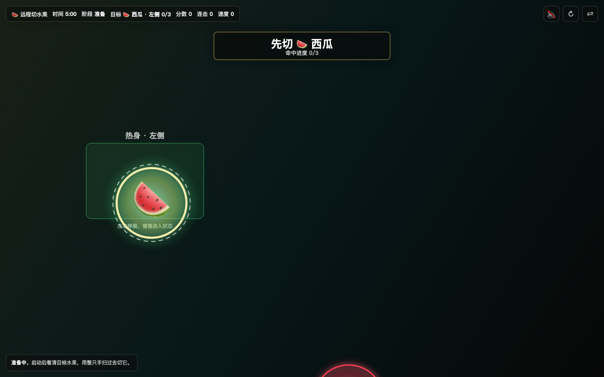

<div align="center">

# 🍉 远程切水果 Demo

### Air Fruit Slicer

#### 把久坐后的 5 分钟唤醒，做成一个隔空挥手玩的网页

[](index.html)
[](https://developers.google.com/mediapipe)
[](https://fruitfit.midao.site/)
[](LICENSE)

### 🚀 [打开网页玩一下 → fruitfit.midao.site](https://fruitfit.midao.site/)

</div>

> 这是一个很小的网页实验：坐久了以后，不想打开健身 App，也不想开始一套完整课程，就站起来，对着电脑挥 5 分钟手。

---

## ✨ 它能做什么

打开网页后，它会把“站起来动一下”变成一轮 5 分钟小游戏：

- 用摄像头识别整只手中心，不追踪单根手指
- 屏幕指定目标水果和目标区域，比如“先切西瓜 · 左侧”
- 分成热身、主运动、冲刺、放松四段
- 切对目标加分，连续命中有连击，误切会断节奏
- 结束后显示挥手次数、活跃时间、左右平衡、最高连击
- 没开摄像头时，也可以用鼠标/触摸试玩

> 它不是一个正经健身 App，也不是一个完整游戏。它更像一个“久坐后的起身入口”。

<div align="center">



</div>

## 📑 目录

- [谁适合用它](#-谁适合用它)
- [快速上手](#-快速上手)
- [玩法设计](#-玩法设计)
- [技术栈](#️-技术栈)
- [核心文件](#-核心文件)
- [后续可加](#-后续可加)
- [关于我们](#-关于我们)
- [开源许可](#-开源许可)
- [免责声明](#️-免责声明)

## 🧡 谁适合用它

- 🧑‍💻 **久坐办公的人**：想站起来动一下，但不想打开很重的运动 App
- ✍️ **内容创作者 / 独立开发者**：想看怎么把一个生活场景做成小网页
- 💻 **开发者**：想看一个纯静态、无后端、可直接部署的体感网页 Demo
- 🧪 **AI 做网页练习者**：想 fork 一个小项目，改成自己的互动网页

## 🚀 快速上手

> 普通用户**不用看这段**，直接[打开线上网页](https://fruitfit.midao.site/) 就能玩。
> 这段是给想 fork 改造、本地跑、自己部署的人看的。

不会代码？复制下面这段，发给 ChatGPT / Claude / 豆包 / 通义千问任何一个 AI：

```text
我想在我的电脑上部署这个开源项目：
https://github.com/atian-create/air-fruit-slicer-demo

我的系统是 Mac（或 Windows，选一个）。

请一步一步教我，每一步具体要打什么命令、点什么按钮。
遇到错误我会截图发给你。
```

会代码的同学：

```bash
git clone https://github.com/atian-create/air-fruit-slicer-demo.git
cd air-fruit-slicer-demo
python3 -m http.server 5178
# → 打开 http://localhost:5178/
```

> 💡 **纯静态网页** — 没有后端、没有登录、没有数据库。核心就是一个 `index.html`，GitHub Pages 就能部署。

## 🎮 玩法设计

一轮默认 5 分钟。

| 模块 | 设计 |
|---|---|
| 识别方式 | 摄像头识别整只手中心，动作可以更大 |
| 目标机制 | 指定水果 + 指定区域，不是乱挥 |
| 阶段节奏 | 热身 / 主运动 / 冲刺 / 放松 |
| 反馈 | 分数、连击、速度、活跃时间、左右平衡 |
| 兜底 | 鼠标和触摸也能玩 |

我做这个网页时最在意的不是“切水果”本身，而是它能不能让人真的站起来动一下。

## 🛠️ 技术栈

| 层 | 技术 |
|---|---|
| 页面 | 原生 HTML / CSS / JavaScript |
| 手部识别 | MediaPipe Hands |
| 动画 | Canvas 2D |
| 声音 | Web Audio API |
| 部署 | GitHub Pages / 自定义域名 |

## 📂 核心文件

- `index.html` — 网页、样式、游戏逻辑全部在这里
- `docs/images/01-live-demo-wide.png` — GitHub README 展示图
- `README.md` — 项目介绍、玩法、部署和开源说明
- `LICENSE` — MIT 开源协议

## 🧩 后续可加

- 炸弹：切到扣分
- 双手大招：两只手同时横扫清屏
- 慢动作：连续切 5 个后触发
- 60 秒挑战模式
- 真实水果图片 / 3D 水果
- 一组久坐办公唤醒小游戏

## 👋 关于我们

**阿甜** · 内容创作者 · AI 一人公司实践者 · 旅居中

[](https://www.xiaohongshu.com/user/profile/5e65e5720000000001004464)

我最近很喜欢把生活里一个很具体的问题，先做成一个小网页。

不用一开始就想成大产品。能打开、能运行、能发出去、能开源，就已经完成了从想法到作品的第一步。

## 📄 开源许可

[MIT License](LICENSE) — 代码随便拿去用、改、商用、学习，做什么都可以。

## ⚠️ 免责声明

- 这是一个体感网页 Demo，不是医疗、健身或康复建议
- 使用摄像头功能时，请确保周围空间安全，别打到桌角、水杯和屏幕
- 本软件按 MIT 协议开放使用，用户须自行承担使用过程中的所有后果

---

<div align="center">

**如果你改出了好玩的版本，欢迎来小红书找阿甜聊聊 🧡**

Made with 🍉 by 阿甜 · 远程切水果 Demo v0.1.0

</div>
